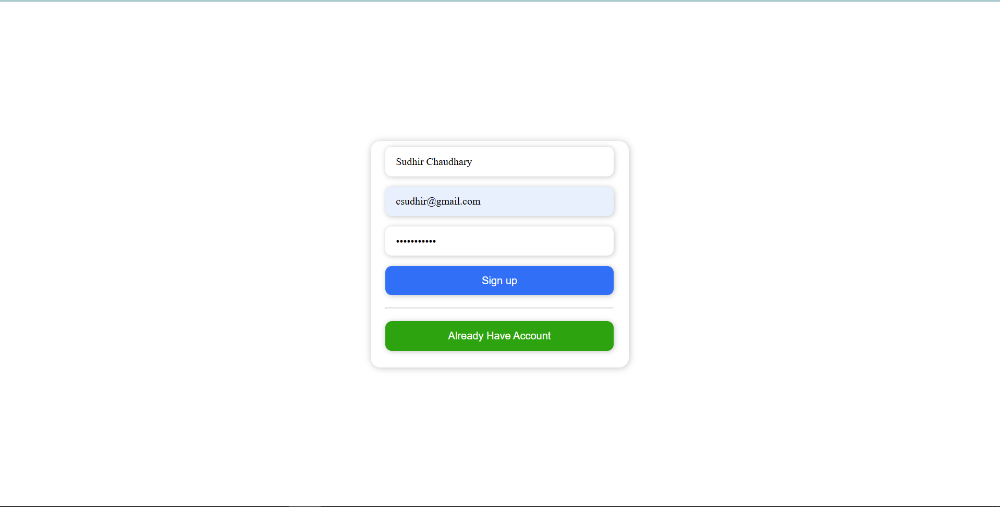
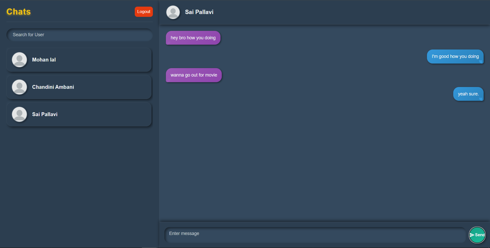
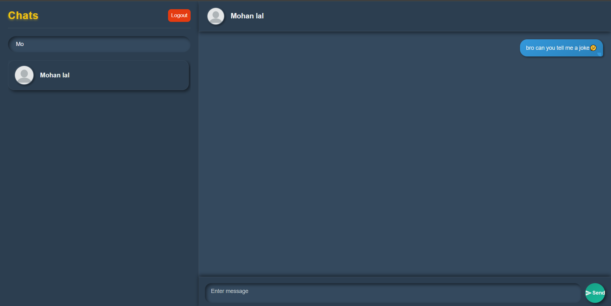
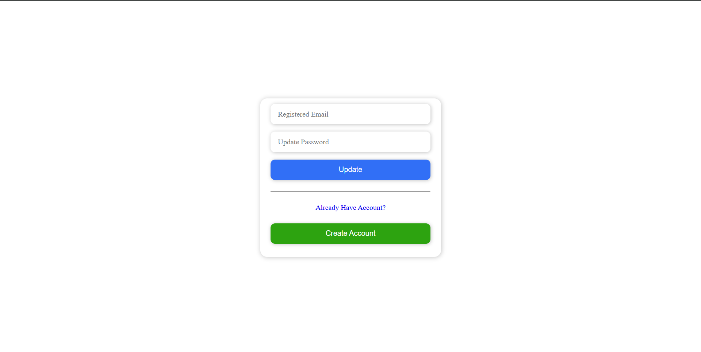
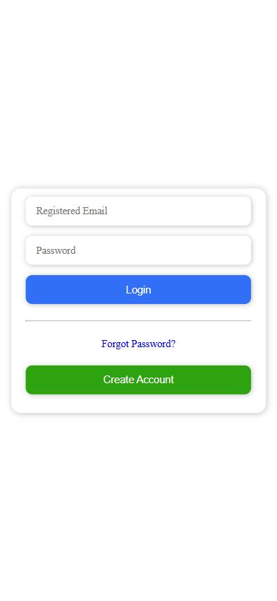
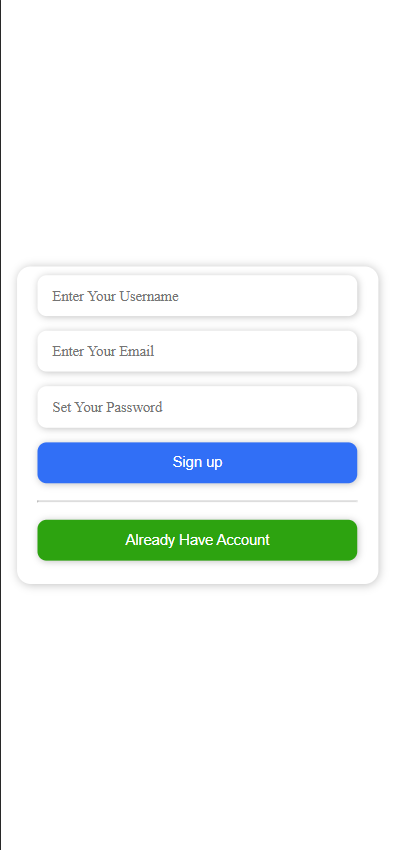
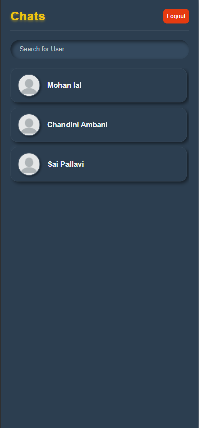
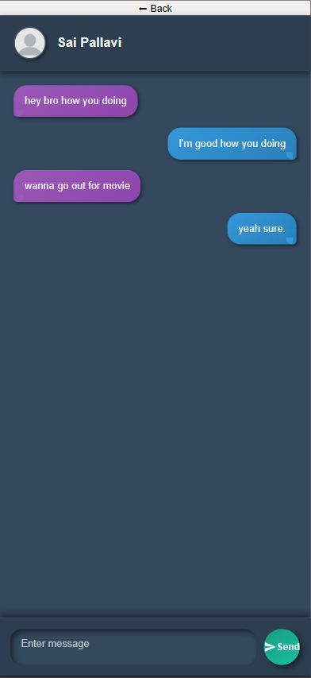
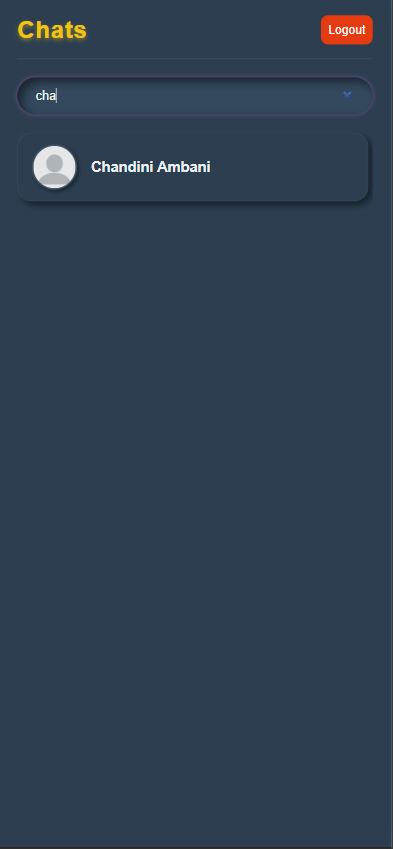

# PingMe


**PingMe** is a full-stack real-time chat web application built using the **MERN** stack. It allows users to register, log in, and chat in real time using **WebSocket technology**. With a clean UI, responsive design, and persistent chat history, PingMe offers a seamless chatting experience.

This frontend app works together with a Node.js + Express backend.

You can find the backend source code here: 
[PingMe-Server (Backend Repo)](https://github.com/Sudhir302/PingMe-Server)

Live on👉: [PingMe Chat App](https://pingme-git-main-sudhir-chaudharys-projects.vercel.app/)

## ⚡️ Features
- User Authentication (Login / Signup)
- Real-time Messaging with Socket.IO
- Message History saved in Mongodb Atlas
- Responsive UI for desktop and mobile
- User search functionality

## Screenshots
<p >
    
    
    
    
    
    <br />
    
    
    
    
    
</p>

## 👩‍💻 Technologies Used
- Frontend: React, CSS3
- Backend: Node.js, Express.js
- Database: MongoDB Atlas
- Authentication: JWT

## 🚀 Getting Started
### Prerequisites
- node
- VS Code
- MongoDb Atlas account

### Installation
1. Clone the Client repository:
    ```
    https://github.com/Sudhir302/PingMe-Client.git
    ```
2. Navigate to the project directory:
    ```
    cd PingMe-Client
    ```
3. Install dependencies:
    ```
    npm install
    ```
4. Run the app
    ```
    npm run dev
    ```
## 🧣 Future Enhancements
- Add typing indicator
- Display notification
- Support for file/media sharing
  
## 📄 License

This project is licensed under the MIT LICENSE - see the [MIT License](./LICENSE) for details.
## Contact
Sudhir Chaudhary - csudhir302@gmail.com
