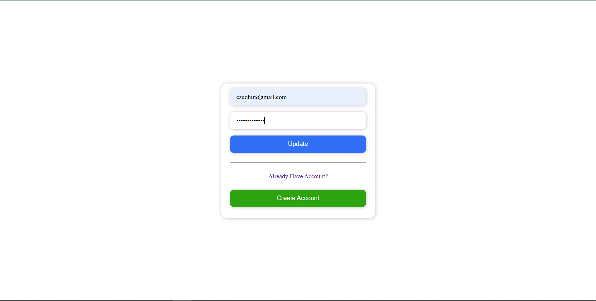

# PingMe


A Full-stack real-time chat web application built with the MERN stack. This app allows users to register, login, and chat in real-time with others using WebSocket technology. It features clean UI, user authentication, persistent message storage, and responsive design for a smooth user experience.
This frontend app works together with a Node.js + Express backend.
You can find the backend source code here: 
    ```
    https://github.com/Sudhir302/PingMe-Server

## ⚡️ Features
- User Authentication (Login / Signup)
- Real-time Messaging with Socket.IO
- Message History saved in Mongodb Atlas
- Responsive UI for desktop and mobile

## Screenshots





## 👩‍💻 Technologies Used
- Frontend: React, CSS3
- Backend: Node.js, Express.js
- Database: MongoDB Atlas
- Authentication: JWT

## 🚀 Getting Started
### Prerequisites
- node
- VS Code
- MongoDb Atlas account

### Installation
1. Clone the Client repository:
    ```
    https://github.com/Sudhir302/PingMe-Client.git

2. Navigate to the project directory:
    ```
    cd PingMe-Client

3. Install dependencies:
    ```
    npm install
4. Run the app
    ```
    npm run dev

## 📄 License

This project is licensed under the MIT LICENSE - see the [MIT License](./LICENSE) for details.
## Contact
Sudhir Chaudhary - csudhir302@gmail.com